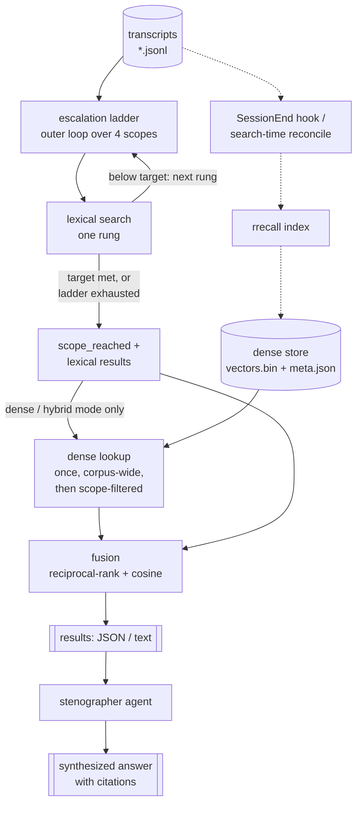

# claude-stenographer

[](https://github.com/navistau/claude-stenographer/actions/workflows/ci.yml)
[](LICENSE)

A Claude Code plugin that searches your past conversation history. Like a court stenographer — "can you read that back to me?"

## What it is

`claude-stenographer` is a Claude Code plugin plus a Rust CLI, `rrecall`, that searches the JSONL transcripts Claude Code already writes to `~/.claude/projects`. It combines lexical (Lucene-syntax, IDF-ranked) and dense (local-embedding) retrieval into a fused `hybrid` mode, then hands raw results to a subagent that reads them and answers in prose with citations.

## Why it's worth having

Claude Code sessions are disposable by default: close the window and the reasoning behind a decision is gone unless someone remembers to write it down. `stenographer` turns every past session into a searchable record, so "why did we pick X over Y" or "what was that error we hit last month" gets answered from the actual transcript instead of reconstructed from memory.

The easy-to-miss benefit is what it does for the *current* conversation, not just the past ones: the search agent is a context firewall. It reads potentially dozens of transcript excerpts and returns only a synthesized answer, so the raw search noise never lands in your main context window. Digging through history costs the subagent's context, not yours.

## Terms

The domain overloads a few words. This table pins each one to a single meaning used consistently below.

| Term | Meaning |
|------|---------|
| Session | One conversation, identified by a session ID; stored as one or more JSONL transcript files (a subagent's log is a separate file attributed to the same session). |
| Project | A Claude Code working directory. `~/.claude/projects` represents each one as a path-encoded directory name, e.g. `-Users-alice-ws-foo` for `/Users/alice/ws/foo`. |
| Index | The dense embedding store (`vectors.bin` + `meta.json`) built by `rrecall index`. Distinct from a project directory and from the transcripts themselves. |
| Mode | Which signal `rrecall search` ranks results by: `lexical`, `dense`, or `hybrid`. |
| Scope / tier | One rung of the escalation ladder (`current_project_recent`, `current_project_all`, `ancestor_projects`, `all_projects`). |
| Escalation ladder | The ordered sequence of scopes `search` widens through, stopping once `--target` results are found. |

## How it works

Transcripts are never modified. `rrecall index` reads them to build a dense index; `rrecall search` reads them (and optionally the index) to answer a query; the stenographer agent calls `search` and writes the answer. The escalation ladder is the outer loop — it runs lexical search one rung at a time and stops once `--target` results are found. Dense lookup and fusion run once, after the ladder settles, only in `dense`/`hybrid` mode.



The dense index is kept fresh two ways: a `SessionEnd` hook incrementally reindexes after every session, and a `dense`/`hybrid` search itself spawns a detached, throttled reindex as a backstop in case the hook didn't fire. Both use the same incremental build, so already-indexed sessions are reused rather than re-embedded.

## When to use it

Use it when you want Claude Code to answer from your own history: "what did we decide about the auth middleware", "have we hit this error before", "what was the reasoning last time we touched this config". It works from inside any project and, via the escalation ladder, across all of them.

It's not a general-purpose transcript browser or a substitute for writing decisions down somewhere durable (a CHANGELOG, an ADR, a commit message) — it only ever quotes what a session actually said, so an undiscussed decision leaves no trail to find. It's also local-only: it searches transcripts already on this machine, not conversations from other machines or accounts.

## Requirements

- Claude Code, to install and run the plugin and its agent.
- macOS or Linux. Prebuilt binaries cover darwin arm64/x64 and linux x64/arm64; there is no Windows build.
- `ripgrep` (`rg`) is recommended but not required. `rrecall search` uses it to pre-filter candidate transcripts; if it's missing, `search` falls back to scanning every transcript directly, silently and correctly, just slower.
- Building from source additionally requires the Rust toolchain (this repo pins `rust = "1.95"` in `mise.toml`).

## Installation

### Marketplace (recommended)

```sh
claude plugin marketplace add navistau/claude-marketplace
```

Then install `stenographer` from that marketplace. The binary is downloaded automatically the next time Claude Code starts.

### Building from source

```sh
git clone https://github.com/navistau/claude-stenographer.git
cd claude-stenographer
cargo build --release
```

This produces `target/release/rrecall`, usable directly as a CLI (`rrecall search "..."`). To make the plugin's hooks and agent use this build instead of downloading a release binary, place it where `plugin/hooks/ensure-binary.sh` looks first — `${CLAUDE_PLUGIN_DATA}/bin/rrecall` (the plugin data directory Claude Code assigns this plugin) — and write the matching version into `${CLAUDE_PLUGIN_DATA}/.binary-version` (the value of `version` in `plugin/.claude-plugin/plugin.json`); with both in place, `ensure-binary.sh` skips its download.

## Configuration reference

### `rrecall search <query> [flags]`

| Flag | Type | Default | Effect |
|------|------|---------|--------|
| `--project-dir <PATH>` | path | `.` | Working directory whose project the search is scoped to. |
| `--all-projects` | flag | off | Skip the escalation ladder; search every project once. |
| `--recent-limit <N>` | integer | `50` | Sessions considered in the `current_project_recent` tier. |
| `--target <N>` | integer | `1` | Escalation stops once this many result windows are found. |
| `--max-results <N>` | integer | `20` | Maximum result windows returned (at most 2 per session). |
| `--context <N>` | integer | `3` | Context messages included around each match. |
| `--claude-dir <PATH>` | path | `~/.claude/projects` | Root projects directory. Env: `RRECALL_PROJECTS_DIR`. |
| `--mode <MODE>` | enum | `hybrid` | One of `lexical`, `dense`, `hybrid`. |
| `--index-dir <PATH>` | path | `~/.cache/rrecall/index` | Dense index location, used by `dense`/`hybrid`. |
| `--dense-weight <F>` | float | `1.5` | Hybrid fusion weight on the dense signal (lexical is fixed at `1.0`). |
| `--format <text\|json>` | enum | `text` | `text` is compact and human-readable; `json` is the full structured output. |

### `rrecall index [flags]`

| Flag | Type | Default | Effect |
|------|------|---------|--------|
| `--all-projects` | flag | off | Index every project instead of just the current one. |
| `--project-dir <PATH>` | path | `.` | Working directory whose project is indexed (ignored with `--all-projects`). |
| `--claude-dir <PATH>` | path | `~/.claude/projects` | Root projects directory. Env: `RRECALL_PROJECTS_DIR`. |
| `--index-dir <PATH>` | path | `~/.cache/rrecall/index` | Where the index is read from and written to. |

Builds are incremental: a session whose transcript files all match the size/mtime signature recorded in the last build is reused verbatim; only new or changed sessions are re-embedded, and within a changed session only new or changed message windows are re-embedded. Embeddings use a local model (`all-MiniLM-L6-v2`, ~90 MB, downloaded once on first use) and are cached under `~/.local/share/rrecall/fastembed`; there is no network access at query time.

### Environment variables

| Variable | Effect |
|----------|--------|
| `RRECALL_PROJECTS_DIR` | Same as `--claude-dir`; the flag takes precedence. |
| `RRECALL_NO_RECONCILE` | Disables the automatic post-search background reindex. Set by the reconcile's own spawned child so it can never recurse; not normally needed by users. |

### Plugin hooks

| Hook | Script | Behavior |
|------|--------|----------|
| `SessionStart` | `plugin/hooks/ensure-binary.sh` | Installs the `rrecall` binary via its per-release, checksum-verified installer if it's missing or out of date, floating to the highest available patch of `plugin.json`'s major.minor (checked at most once/day). |
| `SessionEnd` | `plugin/hooks/reindex.sh` | Spawns a detached, incremental `rrecall index --all-projects` so the session just finished becomes searchable. |

The stenographer agent additionally installs a `PreToolUse(Bash)` hook (`plugin/hooks/restrict-to-rrecall.sh`) that blocks any Bash command the agent runs which isn't `rrecall` itself (optionally piped through `jq`/`head`/`tail`/`sort`/`uniq`/`wc`) — it exists so a search miss produces a refined query, not a fallback to `grep`/`git`/`find` over the filesystem.

## Error and log messages

| Message | Source | Meaning |
|---------|--------|---------|
| `rrecall error: Claude projects directory not found` | `search`, exit 1 | `--claude-dir` / `RRECALL_PROJECTS_DIR` / the default `~/.claude/projects` doesn't exist. |
| `warning: skipped N malformed lines` | `search` | N transcript lines failed to parse as JSON and were skipped; the rest of the session is still searched. |
| `warning: no index at <path>; falling back to lexical mode` | `search`, `dense`/`hybrid` | No dense index exists yet at `--index-dir`; results are lexical-only for this run. |
| `warning: embedder init failed (<err>); lexical fallback` | `search`, `dense`/`hybrid` | The embedding model failed to load (e.g. first-run download issue); results are lexical-only for this run. |
| `index: another build is in progress; skipping` | `index` | Another `rrecall index` already holds the build lock for this `--index-dir`; this run exits without doing anything. |
| `index: R sessions reused, U updated (C chunks reused, E embedded), T chunks total -> <dir>` | `index` | Successful build summary: reused vs. re-embedded sessions and chunks. |
| `index build failed: <err>` | `index`, exit 1 | The build failed before completing (I/O or embedding error). |
| `warning: checkpoint failed: <err>` | `index` | A periodic mid-build checkpoint save failed; the build keeps going (only resumability is at risk). |
| `No matches. The scope ladder already reached the reported scope...` | `search` text output | Zero results at the scope reached; treat it as a query/ranking miss, not evidence the sessions don't exist. |
| `ensure-binary: <what failed> — stenographer binary unavailable this session (will retry next session).` | `SessionStart` hook, stderr | The binary install/update failed (offline, download error, a mismatched installer signature, ...); session start still proceeds, and the next session retries. |

## Troubleshooting

1. **No results at all.** Confirm `~/.claude/projects` exists and holds `.jsonl` files, or pass `--claude-dir`/`RRECALL_PROJECTS_DIR` at the right path. The `Claude projects directory not found` error means the directory rrecall looked at doesn't exist.
2. **`dense`/`hybrid` search behaves like `lexical`.** Check stderr for `no index at <path>; falling back to lexical mode`. Run `rrecall index --all-projects` to build one; `SessionEnd` and search-time reconcile keep it updated afterward.
3. **`embedder init failed` warning.** The local embedding model failed to load, most often a first-run download problem. Confirm network access once (it's only needed the first time the model downloads) and that `~/.local/share/rrecall/fastembed` is writable.
4. **First `rrecall index --all-projects` run is very slow.** The first build (or one run against a deleted/never-built index) has no manifest to reuse and re-embeds every session once; subsequent runs are incremental and only touch new or changed sessions.
5. **A specific old session never shows up.** There's no recency floor — rrecall reads every transcript regardless of age. Treat a miss as a vocabulary/ranking problem: broaden the query's OR terms, or pin a rare `AND` term, before assuming the session isn't indexed.
6. **Candidate scanning seems slow.** Check whether `ripgrep` (`rg`) is on `PATH`. Without it, `search` still works but falls back to scanning every transcript file directly.
7. **The stenographer agent's Bash command gets blocked.** That's `restrict-to-rrecall.sh` doing its job — the agent tried something other than `rrecall`. Refine the `rrecall` query instead; this is not a bug to work around.

## Design constraints

The escalation ladder deliberately trades completeness for speed: a query stops widening scope as soon as `--target` results are found, so a default run over a small, well-matched project never has to touch the whole corpus. `--all-projects` opts out of that trade-off entirely.

The dense index is a flat, brute-force cosine-similarity store — a linear scan over `vectors.bin`, not an ANN index. That's a deliberate simplicity choice for the corpus sizes a single user's Claude Code history reaches; `src/index.rs` isolates the store behind a small interface specifically so it can be swapped for `sqlite-vec`/HNSW later if a corpus grows large enough to make the scan slow (see `ROADMAP.md`, "ANN store").

`--dense-weight`'s default of `1.5` was tuned on a small, hand-built probe set (see `ROADMAP.md`, "Fusion weight is tuned on 4 probes") rather than a large labelled benchmark — treat it as a reasonable starting point, not a proven optimum, if you're chasing ranking quality on your own corpus.

Incremental reuse keys on each transcript file's size/mtime signature; it detects added or changed files but not a *removed* one, so a session that later drops a file can leave a stale entry in the index until a full rebuild (documented in `ROADMAP.md` under "Removed-file detection").

The embedding model is fixed at `all-MiniLM-L6-v2` (384 dimensions) — there's no model-selection flag, keeping the index format and the fusion math (which assumes one fixed embedding space) simple.

## Tests

`tests/integration.rs` is the authoritative suite: five tests that build the real binary and drive it as a subprocess through its actual CLI surface — flags, JSON output shape, exit codes, and the escalation ladder's tier-selection behavior end to end. That's the contract users and the plugin's hooks actually depend on, so it's what has to stay green.

The 64 unit tests spread across `src/*.rs` cover the algorithmic building blocks in isolation (query parsing, IDF scoring, fusion, path/scope encoding, chunking, index checkpointing) and exist to make failures in those building blocks fast to localize — but passing unit tests alone don't prove the CLI itself still behaves correctly, which is what the integration suite is for.

`tests/evals/scenarios.yaml` is a separate, LLM-judged behavioral suite for the agent (does it dispatch correctly, ask for a query when none is given, refuse to fall back to another tool) run interactively against a live Claude Code session, not via `cargo test`; it's not part of CI.

```sh
cargo test
```

## Contributing

See [CONTRIBUTING.md](CONTRIBUTING.md) for the branch model, build/test commands, and the documentation style used in this README.

## Security

See [SECURITY.md](SECURITY.md) to report a vulnerability.

## License

MIT — see [LICENSE](LICENSE).
